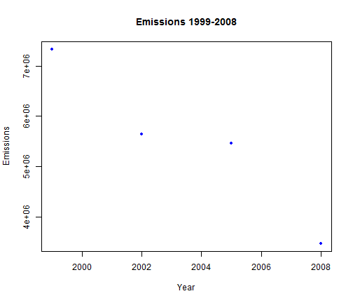

Fine particulate matter (PM2.5) Analysis 
========================================================

Fine particulate matter (PM2.5) is an ambient air pollutant for which there is strong evidence that it is harmful to human health. In the United States, the Environmental Protection Agency (EPA) is tasked with setting national ambient air quality standards for fine PM and for tracking the emissions of this pollutant into the atmosphere. Approximatly every 3 years, the EPA releases its database on emissions of PM2.5. This database is known as the National Emissions Inventory (NEI). 

This project calls for the following tasks: 


1.   Have total emissions from PM2.5 decreased in the United States from 1999 to 2008? Using the base plotting system, make a plot showing the total PM2.5 emission from all sources for each of the years 1999, 2002, 2005, and 2008.

2.    Have total emissions from PM2.5 decreased in the Baltimore City, Maryland (fips == "24510") from 1999 to 2008? Use the base plotting system to make a plot answering this question.

3.    Of the four types of sources indicated by the type (point, nonpoint, onroad, nonroad) variable, which of these four sources have seen decreases in emissions from 1999–2008 for Baltimore City? Which have seen increases in emissions from 1999–2008? Use the ggplot2 plotting system to make a plot answer this question.

4.    Across the United States, how have emissions from coal combustion-related sources changed from 1999–2008?

5.    How have emissions from motor vehicle sources changed from 1999–2008 in Baltimore City?

6.   Compare emissions from motor vehicle sources in Baltimore City with emissions from motor vehicle sources in Los Angeles County, California (fips == "06037"). Which city has seen greater changes over time in motor vehicle emissions?


## Read in data

First read in the data and make the NEI year a factor. Transforming the 
year into  factor will come in handy in this case.

First check to see if the database is already loaded into memory; 
if not, then load it.  


```r
NEI <- readRDS("./data/summarySCC_PM25.rds")
```


## Task 1 - PM2.5 Growth Patterns for US between 1999-2008

Using the base plotting system, make a plot showing the total PM2.5 emission from all sources for each of the years 1999, 2002, 2005, and 2008.


```r
sums <- aggregate(NEI$Emissions, by = list(Year = NEI$year), FUN = sum)
colnames(sums) <- c("Year", "Emissions")
```


You can also embed plots, for example:


```r
plot(sums$Year, sums$Emissions, col = "blue", pch = 20, xlab = "Year", ylab = "Emissions", 
    main = "Emissions 1999-2008")
```

 


